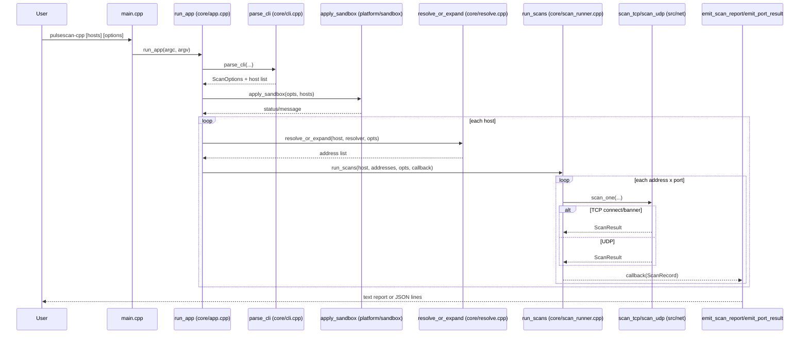
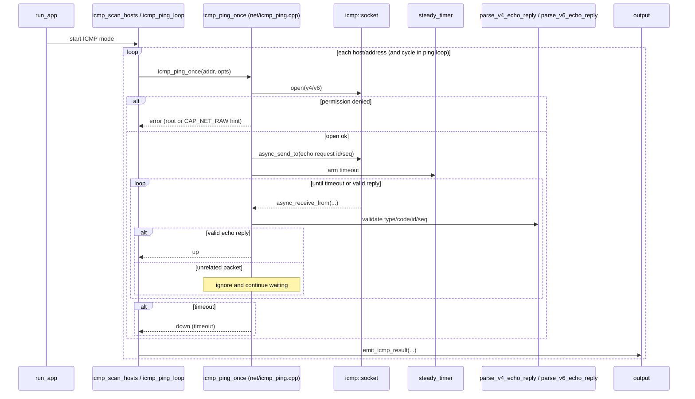
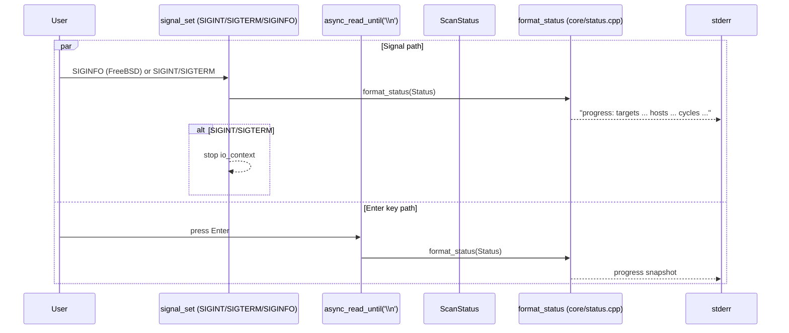

# Sequence Diagrams

These diagrams capture key runtime flows in `pulsescan-cpp` using Mermaid.
Source files for CI rendering are under `docs/diagrams/*.mmd`.

## CLI to Port Scan Flow



## Ping Loop Change Detection (`--ping`)

```mermaid
sequenceDiagram
    participant App as run_app
    participant Loop as ping_loop (core/ping_loop.cpp)
    participant Resolve as resolve_or_expand
    participant Runner as run_scans
    participant State as last_state map
    participant Out as emit_port_result / emit_unavailable

    App->>Loop: ping_loop(hosts, opts, status)
    loop every opts.ping_interval
        Loop->>Resolve: resolve targets for current cycle
        Resolve-->>Loop: addresses
        Loop->>Runner: run_scans(..., callback)
        Runner-->>Loop: ScanRecord stream
        Loop->>State: compare current state vs previous
        alt first pass or changed
            Loop->>Out: emit_port_result(change=true/first)
        else unchanged
            Note over Loop: No text output; JSON depends on filters
        end
        Loop->>State: prune missing keys
        alt key disappeared
            Loop->>Out: emit_unavailable(...)
        end
    end
```

## ICMP Ping Flow (`--icmp-ping`)



## Status Signals / Enter Key Progress


